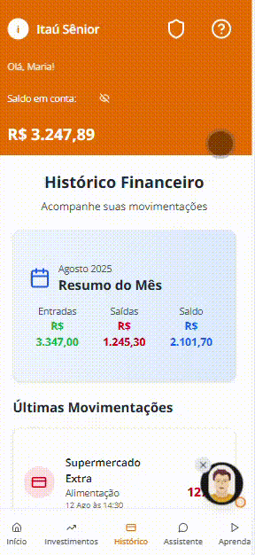
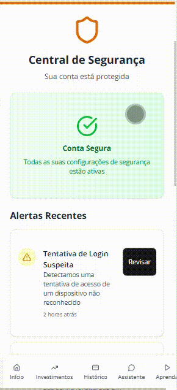
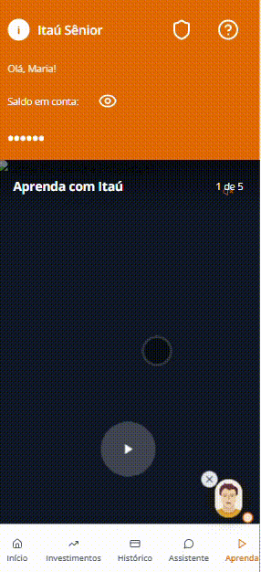

# Interface

&emsp;Para exemplificar a solução proposta, foi produzido [um mockup do aplicativo Itaú Sênior](https://itau-senior.vercel.app/), adaptado às necessidades do público idoso com baixa familiaridade digital. O design mantém todas as funcionalidades tradicionais do aplicativo original, porém apresenta uma organização visual simplificada, linguagem clara e recursos de acessibilidade aprimorados, garantindo que o usuário possa usufruir de todas as possibilidades do app sem restrições. Além disso, foram feitos ajustes estratégicos de navegação e identidade visual para otimizar a experiência e o acesso às funcionalidades.

&emsp;A página inicial reúne as funções essenciais e o conteúdo diário de forma amigável e personalizada. Ao abrir o aplicativo, o usuário é recebido com uma saudação nominal, acompanhada de um “bom dia” e de um mini player de áudio com uma dica financeira personalizada do dia, em formato semelhante a um pequeno podcast. O ícone de som, posicionado ao lado do título, foi adaptado para a cor laranja, reforçando a identidade visual do Itaú. Também é possível explorar outros áudios educativos, promovendo aprendizado contínuo de maneira leve. Logo abaixo, encontram-se botões de ações rápidas — como transferir, pagar contas, acessar a poupança e fazer recargas — dispostos com ícones grandes e texto legível para facilitar a interação. Um avatar flutuante, representando o assistente de voz, está sempre visível na tela, permitindo que o usuário inicie conversas ou peça explicações sobre produtos financeiros a qualquer momento.

Página inicial da interface do Itaú Sênior

  </img>

Fonte: Produzida pelos autores (2025).  Disponível no [link.](https://itau-senior.vercel.app/)

&emsp;A página de investimentos foi projetada para facilitar a compreensão e estimular a tomada de decisões seguras. Nela, o usuário encontra recomendações personalizadas com base em seu perfil e momento de vida, descritas de forma simples e objetiva, além de uma organização visual que prioriza clareza e confiança. Há também materiais de apoio para explicar os produtos financeiros disponíveis, garantindo que o idoso possa investir com segurança e autonomia.

Página de "Investimentos" do Itaú Sênior

  </img>

Fonte: Produzida pelos autores (2025).  Disponível no [link.](https://itau-senior.vercel.app/)

&emsp;A página de histórico concentra todas as transações realizadas, exibindo informações de forma cronológica e organizada, com alto contraste e espaçamento adequado para leitura confortável. Essa seção foi pensada para que o usuário consiga acompanhar suas movimentações sem esforço, incluindo filtros que permitem localizar operações específicas com facilidade.

Página de "Histórico" da interface do Itaú Sênior

  </img>

Fonte: Produzida pelos autores (2025).  Disponível no [link.](https://itau-senior.vercel.app/)

&emsp;Na página de segurança, o foco é oferecer proteção ativa contra golpes e reforçar a confiança no ambiente digital. Acessada pelo ícone no canto superior direito, próximo ao botão de ajuda, essa seção apresenta alertas sobre tentativas suspeitas, dicas práticas de prevenção e informações sobre atividades recentes na conta, permitindo ações rápidas para bloqueio ou confirmação de operações. Essa área também serve como um espaço educativo sobre segurança financeira.

Página de "Segurança" da interface do Itaú Sênior

  </img>

Fonte: Produzida pelos autores (2025).  Disponível no [link.](https://itau-senior.vercel.app/)

&emsp;A página do assistente foi desenvolvida para possibilitar interação direta com um suporte inteligente, por meio de texto ou mensagens de voz. O avatar com smiley face aparece em toda a navegação e, ao ser tocado, abre um chat no qual o usuário pode digitar ou gravar áudios para obter respostas rápidas. O assistente explica conteúdos, sugere investimentos e guia o usuário na realização de tarefas dentro do aplicativo, sempre com linguagem acessível e exemplos claros.

&emsp;Por fim, a página “Aprenda” oferece um espaço de educação financeira contínua, com um feed de vídeos curtos e didáticos, inspirados no formato vertical de redes sociais como o TikTok. Os conteúdos abordam temas como investimentos, organização financeira e segurança, sempre adaptados ao público idoso e apresentados de maneira simples, visual e envolvente. Com o ícone agora presente na barra inferior, o acesso a essa seção está mais rápido e intuitivo, incentivando o uso frequente e fortalecendo o vínculo do usuário com a educação financeira.

Página inicial de "Aprenda" e "Assistente" do Itaú Sênior

  </img>

Fonte: Produzida pelos autores (2025).  Disponível no [link.](https://itau-senior.vercel.app/)

